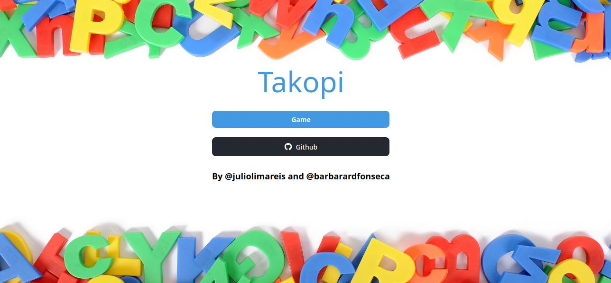
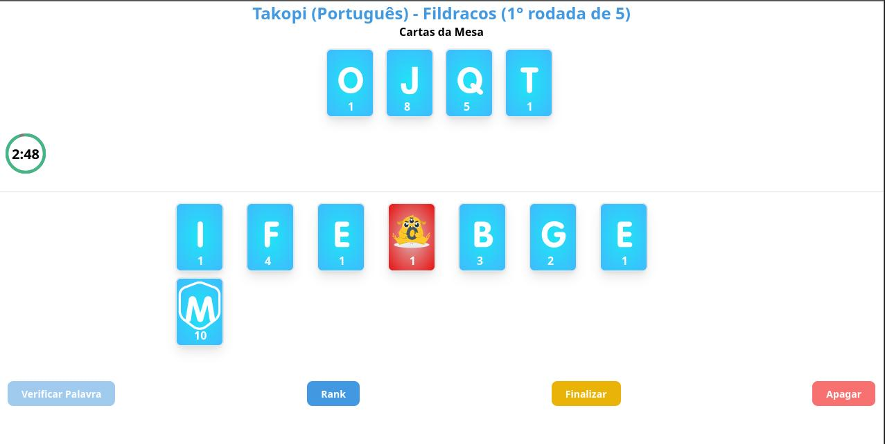

# Takopi

<a target="_blank" href="https://nuxt.com/"></a>
<a target="_blank" href="https://tailwindcss.com/">

</a>



<br />

## Intro
Bem-vindo ao projeto do Jogo de Cartas de Montar Palavras **Takopi!** Este é um jogo empolgante que desafia os jogadores a criar palavras a partir de um conjunto de cartas embaralhadas. O jogo foi desenvolvido usando o framework Nuxt.js, que permite a criação de aplicativos web rápidos e escaláveis.



<br />

## Como executar o projeto localmente

Siga as etapas abaixo para executar o projeto localmente no seu ambiente de desenvolvimento:

### 1. Clone o branch **main** do repositório do projeto para o seu computador.

### 2. Executando o projeto no módulo dev.

Instalando dependências
```bash
yarn install
```
ou
``` bash
npm install
```
ou
``` bash
pnpm install
```

Execute o servidor de dev

```bash
npm run dev
```

### 3. Via docker-compose
``` sh
docker-compose up --build -d
```

### 4. Acesse o aplicativo no seu navegador em `http://localhost:3000`

---

## Contribuição

Se você deseja contribuir para este projeto, sinta-se à vontade para enviar solicitações de pull. Certifique-se de seguir as diretrizes de inclusão e seguir os padrões de código existentes.

## Licença

Este projeto é licenciado sob a Licença MIT. Consulte o arquivo LICENSE para obter mais informações.This project is licensed under the MIT License. See the `LICENSE` file for more information.

---

Espero que este README forneça todas as informações necessárias para entender e executar o `TAKOPI` desenvolvido em Nuxt JS e Tailwind CSS. Divirta-se e crie dinossauros!
